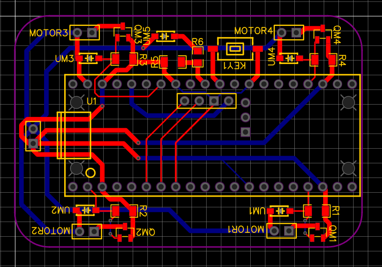
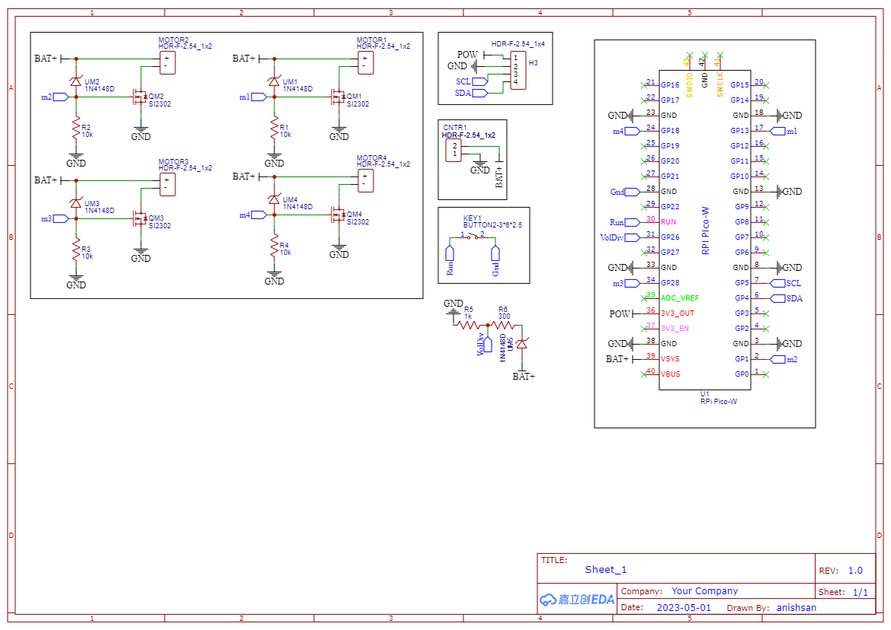

.. PicoW_Copter_Docs documentation master file, created by
   sphinx-quickstart on Tue May  9 16:37:36 2023.
   You can adapt this file completely to your liking, but it should at least
   contain the root `toctree` directive.

Welcome to PicoW_Copter_Docs's documentation!
=============================================
This is the Official Documentation for the PicoW Copter
The PicoW Copter is an open source micro sub 60g quadcopter that is controlled using WiFi via a smartphone or computer.
The PicoW Copter is designed to be a low cost, easy to build, and fun to fly quadcopter.

About Author
============
The Raspberry pi pico W Quadcopter is a project made by Anish Natekar during the summer break after his 3rd semester of BTech
in Computer Science and Engineering at IIT Goa using the knowledge gained from working on Quadcopters, Robots and RC planes for a about year.
This project is a way to give back to the community and help others learn about quadcopters, pcb designing, electronics, sensors, wired+wireless communication and programming.
The cost for the complete project is between Rs 2000 to Rs 2500 (INR) i.e. near $25 to $30 (USD) and the list for the componets, pcb gerbers, android APP, quadcopter code is all open source.
This quadcopter is small enough to fly indoors and not cause too much damage on collision but please do take necessary precautions while flying.
This quadcopter is light enough to not require any registration/certification in countries like India and the USA but please do check your local laws before flying.

Hardware
========

The Hardware required can be found in the Hardware folder of PicoW Copter project.
The Harware folders contains a BOM, PCB gerber files, and STL file for the frame.
The BOM provided contains links for the parts from online indian websites but you can easily find them for other countries as well.

Bill of Materials
-----------------

.. list-table:: BOM
   :widths: 25 25 50
   :header-rows: 1

   * - Part Name 
     - Quantity 
     - Link
   * - Raspberry Pi Pico W 
     - 1 
     - https://robu.in/product/raspberry-pi-pico-w/ |
   * - MPU6050 
     - 1 
     - https://robu.in/product/mpu-6050-gyro-sensor-2-accelerometer/ |
   * - 1S 360mAh Lipo Battery 
     - 1 
     - https://robu.in/product/orange-360-mah-1s-30c-60c-lithium-polymer-battery-pack-lipo/ |
   * - 720 Coreless Motor 
     - 4 
     - https://robu.in/product/8520-magnetic-micro-coreless-motor-for-micro-quadcopters-2xcw-2xccw/ |
   * - 55mm Propeller (included with motors) 
     - 4 
     - https://robu.in/product/8520-magnetic-micro-coreless-motor-for-micro-quadcopters-2xcw-2xccw/ |
   * - si2302 N channel Mosfet 
     - 4 
     - https://www.ktron.in/product/si2302-mosfet-sot23/ |
   * - 1N4007 Diode 
     - 4 
     - https://robu.in/product/1n4148-surface-mount-zener-diode-pack-of-30/ |
   * - Male Pin headers 
     - 44 
     - https://www.ktron.in/product/header-pins-40x1-2-54mm-pitch-brass/ |
   * - Female Pin headers 
     - 40 
     - https://www.ktron.in/product/berg-strip-female-2-54mm-brass/ |
   * - XH male connector 
     - 1 
     - https://www.ktron.in/product/2pin-jst-xh-male-connector/ |
   * - Push Button 
     - 1 
     - https://www.ktron.in/product/3x6x2-5mm-tactile-switch-smd/ |
   * - BMP 280 (Not used yet but will be used in future)
     - 1 
     - https://robu.in/product/bmp280-barometric-pressure-and-altitude-sensor-i2c-spi-module/ |
   * - 1S Lipo charger 
     - 1 
     - https://robu.in/product/4-port-dc5v-1s-rc-lithium-lipo-battery-compact-balance-charger-rc-quadcopter/ |

Taking Rs 160 for 1 PCB and Rs 160 for 3D printed frame from an online service.
The total cost of the hardware is just above 2000 INR or 25 USD.

.. note::
    Most of the hardware won't be available in small quantities so it is adviced to anyone looking to build this project to try to build multiple of them either for yourself or a group of friends.

PCB
---

The PCB Gerber files are given in the *PCB_Gerber_PicoW_Copter* folder.
The PCB is a double layered, 4cm X 6cm, 1oz copper, 1.6mm PCB. 

Testing
=======

Testing script are not only useful to test individual hardware components of the PicoW Copter
but also a great way to learn how individual components work.
This project is complex but extremely affordable allowing room for errors and mistakes even for complete beginners.
Anyone looking to modify the code and hardware is more than welcome to do so. 

Receiver
--------

The PicoW Copter uses the onboard infenion WiFi chip of the raspberry Pi PicoW to communicate with a device (smartphone or computer) through UDP packets.
The static IP address when using the Pi Pico over access point mode (hotspot mode) is 192.168.1.42 by default.  
The main motivation for using UDP is real time control of the PicoW Copter. The time taken to read packets is around 200 microseconds.

.. code-block:: arduino
  :linenos:

  #include <WiFi.h>
  #include <WiFiUdp.h>

  #ifndef APSSID
  #define APSSID "PicoW"    // name of your PicoW Hotspot
  #define APPSW "password" // password of your PicoW Hotspot
  #endif
  #define UDP_PKT_MAX_SIZE 16 //  number of characters in a UDP packet

  unsigned int localPort = 8888;  // local port for UDP communication
  char packetBuffer[UDP_PKT_MAX_SIZE + 1];  // max number of characters received in one message
  int Throttle, Roll, Pitch, Yaw; // values received from each channel
  int prev;

  WiFiUDP Udp; // Object for WIFI UDP class

  void setup() {
    Serial.begin(115200);
    WiFi.mode(WIFI_AP); // Access Point mode
    WiFi.begin(APSSID, APPSW);  // By default static IP for PicoW will be 192.168.42.1
    while(WiFi.status() != WL_CONNECTED) {
      Serial.print('.');  // waiting for connection
      delay(500); // 0.5 sec delay
    }    
    Serial.print("\nConnected! IP address: ");
    Serial.println(WiFi.localIP());   // The IP Address is 192.168.42.1
    Serial.printf("UDP server on port %d\n", localPort);  // Port is 8888
    Udp.begin(localPort); // start listening on port 8888
  }

  void loop() {
    // if there is data available to read then read a packet
    int packetSize = Udp.parsePacket();
    if(packetSize) {  // if packet size is > 0
      prev = micros();
      int n = Udp.read(packetBuffer, UDP_PKT_MAX_SIZE); // read the data from UDP packet into packetBuffer
      packetBuffer[n] = '\0'; // character for end of string
      char ch1[5], ch2[5], ch3[5], ch4[5];  // 
      ch1[4] = '\0'; ch2[4] = '\0'; ch3[4] = '\0'; ch4[4] = '\0';
      for(int i=0; i<4; i++) {
        // Spliting the packets into four values of 4 characters each
        ch1[i] = packetBuffer[i];
        ch2[i] = packetBuffer[i+4];
        ch3[i] = packetBuffer[i+8];
        ch4[i] = packetBuffer[i+12];            
      }    
      // converting string/character arrays to integer
      Yaw = atoi(ch1);
      Throttle = atoi(ch2);
      Roll = atoi(ch3);
      Pitch = atoi(ch4);    
      Serial.printf("Yaw = %d, Throttle = %d, Roll = %d, Pitch = %d\n", Yaw, Throttle, Roll, Pitch);
      Serial.printf("Time taken = %d\n", micros() - prev);
    }   
  }

The UDP packets are sent by an APP or software (in our case this python code) on the device to the PicoW's IP address and port number provided in the Receiver.ino file.

.. code-block:: python
  :linenos:

  import socket
  import time

  UDP_IP = "192.168.1.42"
  UDP_PORT = 8888
  MESSAGE = "1000100110021003" # sending four 4 digit long numbers

  # creating a UDP socket (UDP is connection less)
  server = socket.socket(socket.AF_INET, socket.SOCK_DGRAM)
  while True:
      server.sendto(MESSAGE.encode('utf-8'), (UDP_IP, UDP_PORT))
      # sleep for 1 second
      time.sleep(1)

Gyro
----

The MPU6050 is a 6 axis gyroscope and accelerometer sensor. It is used to measure the orientation of the PicoW Copter.
The MPU6050 is connected to the Pi PicoW using I2C protocol communicatin at a frequency of 400kHz. The I2C address of the MPU6050 is 0x68.
All i2c register addresses can be found in the MPU6050 manual by invensense. Joop Brokking has a great tutorial on how to use the MPU6050 with Arduino.
The time taken to read IMU data is around 400 microseconds.

.. code-block:: arduino
  :linenos:

  #include<Wire.h>

  #define I2C_CLK_FREQ 400000 // 400kHz
  const u_int8_t IMUAddress = 0x68;  // Address for MPU6050 IMU sensor
  // IMU offset 
  int16_t gyroXoffset = 0;  
  int16_t gyroYoffset = 0;  
  int16_t gyroZoffset = 0;  
  int16_t accXoffset = 0;   
  int16_t accYoffset = 0;   
  int16_t accZoffset = 0;   
  // MPU6050 IMU 
  int16_t accX, accY, accZ; // accelerometer
  int16_t tempRaw;  
  int16_t gyroX, gyroY, gyroZ; // gyroscope
  float temp; // temperature
  int prev;   // keeps track of time before reading IMU data

  void setup() {
    pinMode(LED_BUILTIN, OUTPUT); // set the built in LED pin as Output
    Serial.begin(115200);
    Wire.setClock(I2C_CLK_FREQ);  // setting I2C communication frequency to 400kHz
    Wire.begin(); // starting I2C communication over SDA0 and SCL0 pins
    
    Wire.beginTransmission(IMUAddress);
    Wire.write(0x6B); // PWR_MGMT_1
    Wire.write(0x00);
    Wire.endTransmission();

    Wire.beginTransmission(IMUAddress);
    Wire.write(0x1B); // GYRO_CONFIG
    Wire.write(0x08); // +- 1000 degrees/s
    Wire.endTransmission();

    Wire.beginTransmission(IMUAddress);
    Wire.write(0x1C); // ACCEL_CONFIG
    Wire.write(0x10); // +- 16g
    Wire.endTransmission();

    Wire.beginTransmission(IMUAddress);
    Wire.write(0x1A); // CONFIG
    Wire.write(0x03);
    Wire.endTransmission();

    // IMU offset calculation
    int offcnt;
    long gx=0, gy=0, gz=0, ax=0, ay=0, az=0;  // variables to store sum of 1000 readings
    for(offcnt=0; offcnt<=1000; offcnt++) {
      // Reading IMU data 1000 times to calculate offset values of IMU
      Wire.beginTransmission(IMUAddress);
      Wire.write(0x3B); // GyroXhigh byte
      Wire.endTransmission();
      Wire.requestFrom(IMUAddress, 14); // request 14 bytes of data from IMU
      while(Wire.available() < 14); // If we have received 14 bytes exit out of loop
      // read IMU data values
      accX = Wire.read()<<8|Wire.read();
      accY = Wire.read()<<8|Wire.read();
      accZ = Wire.read()<<8|Wire.read();
      tempRaw = Wire.read()<<8|Wire.read();
      gyroX = Wire.read()<<8|Wire.read();
      gyroY = Wire.read()<<8|Wire.read();
      gyroZ = Wire.read()<<8|Wire.read();   
      // Sum the values read from IMU
      gx += gyroX;
      gy += gyroY;
      gz += gyroZ;
      ax += accX;
      ay += accY;
      az += accZ;
      delay(3); // simulating delay for rest of the quadcopter processes
      if(offcnt%40 == 0)    
        digitalWrite(LED_BUILTIN, HIGH);  // LED blinks to indicate offset calculation is going on
      else
        digitalWrite(LED_BUILTIN, LOW);
    }  
    // get the average of 1000 readings
    gyroXoffset = (int16_t)(gx/1000);
    gyroYoffset = (int16_t)(gy/1000);
    gyroZoffset = (int16_t)(gz/1000);
    accXoffset = (int16_t)(ax/1000);
    accYoffset = (int16_t)(ay/1000);
    accZoffset = (int16_t)(az/1000);
  }

  void loop() {
    prev = micros();  // record time when we started reading IMU data
    // read IMU values
    Wire.beginTransmission(IMUAddress);
    Wire.write(0x3B);
    Wire.endTransmission();
    Wire.requestFrom(IMUAddress, 14);

    while(Wire.available() < 14);
    
    accX = Wire.read()<<8|Wire.read();
    accY = Wire.read()<<8|Wire.read();
    accZ = Wire.read()<<8|Wire.read();
    tempRaw = Wire.read()<<8|Wire.read();
    gyroX = Wire.read()<<8|Wire.read();
    gyroY = Wire.read()<<8|Wire.read();
    gyroZ = Wire.read()<<8|Wire.read();   
    // subtract offset from readings 
    gyroX -= gyroXoffset;
    gyroY -= gyroYoffset;
    gyroZ -= gyroZoffset;
    accX -= accXoffset;
    accY -= accYoffset;
    accZ -= accZoffset;
    temp = (float)tempRaw;
    // print data
    //Serial.printf("AccX = %d, AccY = %d, AccZ = %d, Temp = ", accX, accY, accZ);
    //Serial.print(temp);  
    //Serial.printf(", GyroX = %d, GyroY = %d, GyroZ = %d\n", gyroX, gyroY, gyroZ);
    Serial.printf("Time = %d\n", micros() - prev);
    delay(250);
  }

Motors + ESCs
-------------

After you have finished soldering all components on the PCB and soldered the motors in such manner Front Right Motor -> CCW, Front Left Motor -> CW, Bottom Right Motor -> CW, Bottom Left Motor -> CCW where CW means Clock Wise and CCW means Counter Clock Wise.   
The way you can check the direction of rotation of each motor is by taking any AA or AAA battery and testing the motors by holding the wires of the poles of the battery. This will power the motor and you can use your finger to feel the direction of rotation.
In case the motors are spining in the wrong direction you can change the direction of rotation by switching the polarity of the motor connection to the PCB.
The PCB has two through-hole pad for each motor where the round pad indicates +ve terminal and square terminal indicates -ve/ground terminal.
When performing this test please do not attach the propellers to the motors for safety reason.
You can perform this test when powered via USB of the pi pico but it is prefered to power the PCB using the battery.

The motors are controlled by a PWM signal generated by using analog write command on digital pins.
The Mosfets act as a switch to rapidly switch the voltage and current from the battery to the motors
according to the PWM signal received.
The direction of rotation for the motors are same as YMFC or Pixhawk/Arducopter quadcopters i.e.
front right CCW, front left CW, bottom right CW and bottom left CCW. This script is not only useful to test the
motors but also test the direction of rotation of the motors.

.. code-block:: arduino
  :linenos:
  
  #define MOT_TOP_LEFT 18
  #define MOT_TOP_RIGHT 13
  #define MOT_BOTTOM_LEFT 28
  #define MOT_BOTTOM_RIGHT 1
  void setup() {
    // put your setup code here, to run once:
    analogWriteFreq(500); // PWM frequency 500 Hz
    analogWriteRange(1000); // value coresponding to 100% PWM duty cycle

    pinMode(MOT_TOP_LEFT, OUTPUT);
    pinMode(MOT_TOP_RIGHT, OUTPUT);
    pinMode(MOT_BOTTOM_LEFT, OUTPUT);
    pinMode(MOT_BOTTOM_RIGHT, OUTPUT);
    pinMode(LED_BUILTIN, OUTPUT);
    analogWrite(MOT_TOP_LEFT, 0);
    analogWrite(MOT_TOP_RIGHT, 0);
    analogWrite(MOT_BOTTOM_LEFT, 0);
    analogWrite(MOT_BOTTOM_RIGHT, 0);
    
    //Use the led on the Arduino for startup indication.
    digitalWrite(LED_BUILTIN,HIGH);              
  }

  void loop() {
    // put your main code here, to run repeatedly:
    for(int i=0; i<=1000; i++) {
      analogWrite(MOT_TOP_RIGHT, i);
      analogWrite(MOT_BOTTOM_RIGHT, i);
      analogWrite(MOT_BOTTOM_LEFT, i);
      analogWrite(MOT_TOP_LEFT, i);
      delay(2);
    }
    for(int i=0; i<=1000; i++) {
      analogWrite(MOT_TOP_RIGHT, 1000-i);
      analogWrite(MOT_BOTTOM_RIGHT, 1000-i);
      analogWrite(MOT_BOTTOM_LEFT, 1000-i);
      analogWrite(MOT_TOP_LEFT, 1000-i);
      delay(2);
    }
  }

BMP280 (Not yet tested or used in flight controller)
----------------------------------------------------

The BMP280 is a barometric pressure and temperature sensor. It is used for the altitude hold feature of the PicoW Copter.
The details for the i2c registers of the BMP280 sensor can be found in the data sheet along with the conversions.
I will suggest those who are interested to refer to the video by Carbon Aeronautics.
(This feature is not tested nor is included in flight controller yet but a script is provided for getting sensor data for PicoW)

.. code-block:: arduino
  :linenos:

  #include <Wire.h>
  #define BMPAddress 0x76

  // Barometer calibration values
  uint16_t dig_T1, dig_P1;
  int16_t dig_T2, dig_T3, dig_P2, dig_P3, dig_P4, dig_P5;
  int16_t dig_P6, dig_P7, dig_P8, dig_P9;

  // Altitude variables
  float AltitudeBarometer, AltitudeBarometerStartUp;
  int RateCalibrationNumber;

  // read barometer signal
  void barometer_signal() {
    Wire.beginTransmission(BMPAddress);
    Wire.write(0xF7);
    Wire.endTransmission();
    Wire.requestFrom(BMPAddress, 6);
    uint32_t press_msb = Wire.read(); // 0xF7 
    uint32_t press_lsb = Wire.read(); // 0xF8
    uint32_t press_xlsb = Wire.read();
    uint32_t temp_msb = Wire.read();
    uint32_t temp_lsb = Wire.read();  
    uint32_t temp_xlsb = Wire.read(); // 0xFC

    // Construct raw temperature and pressure measurements
    // msb contans bits [19-12], lsb contains bits [11-4], and xlsb contains bits [3-0]
    unsigned long int adc_P = (press_msb<<12)|(press_lsb<<4)|(press_xlsb>>4);
    unsigned long int adc_T = (temp_msb<<12)|(temp_lsb<<4)|(temp_xlsb>>4);

    // Construct fine resolution temperature value
    signed long var1, var2;
    var1 = ((((adc_T>>3)-((signed long int)dig_T1<<1)))*((signed long int)dig_T2))>>11;
    var2 = (((((adc_T>>4) - ((signed long int)dig_T1)) * ((adc_T>>4)-((signed long int)dig_T1)))>>12)*((signed long int)dig_T3))>>14;
    signed long int t_fine = var1 + var2;

    // Construct the compensated and calibrated pressure p according to manufacturer
    unsigned long int p;
    var1 = (((signed long int)t_fine)>>1) - (signed long int)64000;
    var2 = (((var1>>2)*(var1>>2))>>11)*((signed long int)dig_P6);
    var2 = var2 + ((var1*((signed long int)dig_P5))<<1);
    var2 = (var2>>2)+(((signed long int)dig_P4)<<16);
    var1 = (((dig_P3*(((var1>>2)*(var1>>2))>>13))>>3)+((((signed long int)dig_P2)*var1)>>1))>>18;
    var1 = ((((32768+var1))*((signed long int)dig_P1))>>15);
    if(var1 == 0) { p = 0; }
    p = (((unsigned long int)(((signed long int)1048576)-adc_P)-(var2>>12)))*3125;
    if(p<0x80000000) { p = (p<<1) / ((unsigned long int)var1); }
    else { p = (p / (unsigned long int)var1) * 2; }
    var1 = (((signed long int)dig_P9)*((signed long int)(((p>>3)*(p>>3))>>13)))>>12;
    var2 = (((signed long int)(p>>2))*((signed long int)dig_P8))>>13;
    p = (unsigned long int)((signed long int)p + ((var1 + var2 + dig_P7)>>4));

    double pressure = (double)p/100;  // pressure in hPa
    AltitudeBarometer = 44330*(1-pow(pressure/1013.25, 1/5.255))*100; // Altitude in cm
  }

  void setup() {
    // BMP280 setup
    Serial.begin(57600);
    pinMode(LED_BUILTIN, OUTPUT);
    digitalWrite(LED_BUILTIN, HIGH);
    Wire.setClock(400000);
    Wire.begin();
    delay(250);

    // Setup BMP280 barometer optimized for indoor navigation
    Wire.beginTransmission(BMPAddress);
    Wire.write(0xF4); // measurement register setup for indoor mode
    Wire.write(0x57); // normal mode, pressure oversampling x16 temperature oversampling x2
    Wire.endTransmission();   
    // Setup configuration register
    Wire.beginTransmission(BMPAddress);
    Wire.write(0xF5);
    Wire.write(0x14); // IIR filter coefficient 16 rest are 0
    Wire.endTransmission();
    // Importing 12 trimming parameters from sensor
    uint8_t data[24], i = 0;
    // First trimming parameter
    Wire.beginTransmission(BMPAddress);
    Wire.write(0x88);
    Wire.endTransmission();
    Wire.requestFrom(BMPAddress, 24); // 24 bytes of data from register 0x88 to 0x9F
    while(Wire.available()) {
      data[i] = Wire.read();
      i++;
    }    
    dig_T1 = (data[1]<<8) | data[0];
    dig_T2 = (data[3]<<8) | data[2];
    dig_T3 = (data[5]<<8) | data[4];
    dig_P1 = (data[7]<<8) | data[6];
    dig_P2 = (data[9]<<8) | data[8];
    dig_P3 = (data[11]<<8) | data[10];
    dig_P4 = (data[13]<<8) | data[12];
    dig_P5 = (data[15]<<8) | data[14];
    dig_P6 = (data[17]<<8) | data[16];
    dig_P7 = (data[19]<<8) | data[18];
    dig_P8 = (data[21]<<8) | data[20];
    dig_P9 = (data[23]<<8) | data[22];
    delay(250);
    // barometer calibration calculating altitude reference level
    for(RateCalibrationNumber = 0; RateCalibrationNumber<2000; RateCalibrationNumber++) {
      barometer_signal();
      AltitudeBarometerStartUp += AltitudeBarometer;
      delay(1);
    }
    AltitudeBarometerStartUp/=2000;
  }

  void loop() {
    // Read the barometer and print altitudes
    barometer_signal();
    AltitudeBarometer = AltitudeBarometerStartUp;
    Serial.print("Altitude [cm]:");
    Serial.println(AltitudeBarometer);
    delay(50);
  }

Battery voltage
---------------

While flying any quadcopter it is important to keep track of the battery voltage. The battery is a 1S Lipo 360mAh Battery
and it is important to be careful when using Lipo batteries in any project as special care needs to be taken to prevent
over discharge (while flying) and over charge (while charging). If you Lipo looks swollen it is recommended to dispose it in
a controlled manner as provided by the manufacturer i.e. first using a large resistance to slowly discharge the Lipo completely and slowly and then burrying it.
It is highly prefered to dispose Lithium batteries through some professional recycling service as They are can have long term environmental impacts
as according to this article (https://www.intertek.com/uploadedFiles/Intertek/Divisions/Commercial_and_Electrical/Media/PDF/Battery/Environmental-Considerations-for-Lithium-Batteries-White-Paper.pdf)
LION do have some heavy metals like Cobalt, Copper and Nickle so I assume Lipo batteries also have these metals and if burried they can reach into the ground
water to cause heavy metal poisoning but I am not an expert on this topic so I request anyone interested to do their own research.

This script reads the battery voltage from the A0 pin and sends the reading over WiFi using UDP to another device.
To test this script download the UDP Monitor APP from play store. Set the Remote IP Address on the APP to 192.168.42.1 and the Local and Remote PORT to 8888.
Then connect the Battery on the Pico Copter PCB(without the USB cable connected). Find the PicoW Hotspot generated and connect to it using your phone.
once you ae connected and have disabled any WiFi setting for "connect automatically" on your phone open the APP and type something.
Every time you send a message the Pico Copter will send the battery voltage reading back to the APP. 

.. code-block:: arduino
  :linenos:

  #include <WiFi.h>
  #include <WiFiUdp.h>

  #define bat_pin 26
  #define diode_vol_drop 0.7

  #ifndef APSSID
  #define APSSID "PicoW"
  #define APPSW "password"
  #endif
  #define UDP_PKT_MAX_SIZE 16

  unsigned int localPort = 8888;
  char packetBuffer[UDP_PKT_MAX_SIZE + 1];
  char ReplyBuffer[20]; // a string to send back

  WiFiUDP Udp;  // Object for WiFi UDP class

  void setup() {
    pinMode(LED_BUILTIN, OUTPUT);
    digitalWrite(LED_BUILTIN, LOW);
    
    pinMode(bat_pin, INPUT);
    Serial.begin(115200);
    
    WiFi.mode(WIFI_AP);
    WiFi.begin(APSSID, APPSW);
    while (WiFi.status() != WL_CONNECTED) {
          Serial.print(".");
          delay(500);
    }
    Udp.begin(localPort);
    digitalWrite(LED_BUILTIN, HIGH);
    delay(1000);
    digitalWrite(LED_BUILTIN, LOW);
  }

  void loop() {
      int packetSize = Udp.parsePacket();
      if(packetSize) {
          float reading = analogRead(bat_pin) * 3.3 / 1023 * 1300 / 1000 + diode_vol_drop;    
          // put this reading into the buffer
          sprintf(ReplyBuffer, "%f", reading);
          // send the reading back to the sender
          Udp.beginPacket(Udp.remoteIP(), 8888);
          Udp.write(ReplyBuffer);
          Udp.endPacket();
          digitalWrite(LED_BUILTIN, HIGH);
      }
      
      delay(100);
      digitalWrite(LED_BUILTIN, LOW);
  }

Software
========

The main software contains the flight controller. The flight controller is the complete quadcopter code. This code was tested on 21-05-2023.
once you upload the code dsiconnect the pico and keep it in a spacious room on a flat surface. Now plug in the Lipo battery to start the gyro clibration process as shown by fast blinking LED.
Once the LED starts blinking on your smartphone connect to the PicoW hotspot using the password "password".
Now that you have connected the blinking must have stopped. To setup the controls go to the UDP joystick App and enter the IP address 192.168.42.1, port 8888 and rate of 20ms.
Once done tap the button such that it says "ON" to indicate that the App has started and switch to the screen with joysticks.
Now the way you start/ARM the quadcopter is by pulling the throttle joystick (left one) down to zero, moving it to the bottom left corner and back to the bottom center.
The way you stop/DISARM the quadcopter is by bringing the throttle joystick to the bottom right anf back to center.
This code is inspired from YMFC-AL project by Joop Brokking. For more details on PID controller please do refer to his playlist over on YouTube.

.. code-block:: arduino
  :linenos:

  #include <Wire.h>                          //Include the Wire.h library so we can communicate with the gyro.
  #include <WiFi.h>
  #include <WiFiUdp.h>

  #define I2C_CLK_FREQ 400000 // 400kHz
  const u_int8_t IMUAddress = 0x68;  // Address for MPU6050 IMU sensor

  #ifndef APSSID
  #define APSSID "PicoW"
  #define APPSW "password"
  #endif
  #define UDP_PKT_MAX_SIZE 16

  unsigned int localPort = 8888;
  char packetBuffer[UDP_PKT_MAX_SIZE + 1];

  WiFiUDP Udp;  // Object for WiFi UDP class

  #define MOT_TOP_LEFT 18
  #define MOT_TOP_RIGHT 13
  #define MOT_BOTTOM_LEFT 28
  #define MOT_BOTTOM_RIGHT 1

  ///////////////////////////////////////////////////////////////////////////////////////////////////////////////////////////////////////
  //PID gain and limit settings
  ///////////////////////////////////////////////////////////////////////////////////////////////////////////////////////////////////////
  float pid_p_gain_roll = 2.05;               //Gain setting for the roll P-controller
  float pid_i_gain_roll = 0.013;              //Gain setting for the roll I-controller 0.04
  float pid_d_gain_roll = 11.0;              //Gain setting for the roll D-controller
  int pid_max_roll = 300;                    //Maximum output of the PID-controller (+/-)

  float pid_p_gain_pitch = pid_p_gain_roll;  //Gain setting for the pitch P-controller.
  float pid_i_gain_pitch = pid_i_gain_roll;  //Gain setting for the pitch I-controller.
  float pid_d_gain_pitch = pid_d_gain_roll;  //Gain setting for the pitch D-controller.
  int pid_max_pitch = pid_max_roll;          //Maximum output of the PID-controller (+/-)

  float pid_p_gain_yaw = 8.5;                //Gain setting for the pitch P-controller. //4.0
  float pid_i_gain_yaw = 0.005;               //Gain setting for the pitch I-controller. //0.02
  float pid_d_gain_yaw = 0.0;                //Gain setting for the pitch D-controller.
  int pid_max_yaw = 300;                     //Maximum output of the PID-controller (+/-)

  boolean auto_level = true;                 //Auto level on (true) or off (false)

  ///////////////////////////////////////////////////////////////////////////////////////////////////////////////////////////////////////
  //Declaring global variables
  ///////////////////////////////////////////////////////////////////////////////////////////////////////////////////////////////////////
  byte last_channel_1, last_channel_2, last_channel_3, last_channel_4;
  byte highByte, lowByte;
  volatile int receiver_input_channel_1 = 0, receiver_input_channel_2 = 0, receiver_input_channel_3 = 0, receiver_input_channel_4 = 0;
  int counter_channel_1, counter_channel_2, counter_channel_3, counter_channel_4, loop_counter;
  int esc_1, esc_2, esc_3, esc_4;
  int throttle, battery_voltage;
  int cal_int, start, gyro_address;
  int receiver_input[5];
  int temperature;
  int16_t acc_axis[4], gyro_axis[4];
  float roll_level_adjust, pitch_level_adjust;

  long acc_x, acc_y, acc_z, acc_total_vector;
  unsigned long timer_channel_1, timer_channel_2, timer_channel_3, timer_channel_4, esc_timer, esc_loop_timer;
  unsigned long timer_1, timer_2, timer_3, timer_4, current_time;
  unsigned long loop_timer;
  double gyro_pitch, gyro_roll, gyro_yaw;
  double gyro_axis_cal[4];
  float pid_error_temp;
  float pid_i_mem_roll, pid_roll_setpoint, gyro_roll_input, pid_output_roll, pid_last_roll_d_error;
  float pid_i_mem_pitch, pid_pitch_setpoint, gyro_pitch_input, pid_output_pitch, pid_last_pitch_d_error;
  float pid_i_mem_yaw, pid_yaw_setpoint, gyro_yaw_input, pid_output_yaw, pid_last_yaw_d_error;
  float angle_roll_acc, angle_pitch_acc, angle_pitch, angle_roll;
  boolean gyro_angles_set;

  ///////////////////////////////////////////////////////////////////////////////////////////////////////////////////////////////////////
  //Setup routine
  ///////////////////////////////////////////////////////////////////////////////////////////////////////////////////////////////////////
  void setup(){
    
    analogWriteFreq(500); // PWM frequency 500 Hz
    analogWriteRange(1000); // value coresponding to 100% PWM duty cycle

    Serial.begin(115200);
    gyro_address = IMUAddress;      
    Wire.setClock(I2C_CLK_FREQ);   
    Wire.begin();                                                             //Start the I2C as master.

    pinMode(MOT_TOP_LEFT, OUTPUT);
    pinMode(MOT_TOP_RIGHT, OUTPUT);
    pinMode(MOT_BOTTOM_LEFT, OUTPUT);
    pinMode(MOT_BOTTOM_RIGHT, OUTPUT);
    pinMode(LED_BUILTIN, OUTPUT);
    analogWrite(MOT_TOP_LEFT, 0);
    analogWrite(MOT_TOP_RIGHT, 0);
    analogWrite(MOT_BOTTOM_LEFT, 0);
    analogWrite(MOT_BOTTOM_RIGHT, 0);
    
    //Use the led on the Arduino for startup indication.
    digitalWrite(LED_BUILTIN,HIGH);                                                    //Turn on the warning led.

    set_gyro_registers();                                                     //Set the specific gyro registers.

    //Let's take multiple gyro data samples so we can determine the average gyro offset (calibration).
    for (cal_int = 0; cal_int < 2000 ; cal_int ++){                           //Take 2000 readings for calibration.
      if(cal_int % 15 == 0)
        digitalWrite(LED_BUILTIN, !digitalRead(LED_BUILTIN));                //Change the led status to indicate calibration.
      gyro_signalen();                                                        //Read the gyro output.
      gyro_axis_cal[1] += gyro_axis[1];   
      gyro_axis_cal[2] += gyro_axis[2];
      gyro_axis_cal[3] += gyro_axis[3];
      delay(4);                                                               //Wait 3 milliseconds before the next loop.
    }
    //Now that we have 2000 measures, we need to devide by 2000 to get the average gyro offset.
    gyro_axis_cal[1] /= 2000;                                                 //Divide the roll total by 2000.
    gyro_axis_cal[2] /= 2000;                                                 //Divide the pitch total by 2000.
    gyro_axis_cal[3] /= 2000;                                                 //Divide the yaw total by 2000.                                                //Set PCINT3 (digital input 11)to trigger an interrupt on state change.

    WiFi.mode(WIFI_AP);
    WiFi.begin(APSSID, APPSW);
    while(WiFi.status() != WL_CONNECTED) {
      Serial.print('.');    
      delay(500);    
    }
    Udp.begin(localPort);  
    //Wait until the receiver is active and the throtle is set to the lower position.
    while(receiver_input_channel_3 < 990 || receiver_input_channel_3 > 1020 || receiver_input_channel_4 < 1400){
      int packetSize = Udp.parsePacket();
      if(packetSize) {
        int n = Udp.read(packetBuffer, UDP_PKT_MAX_SIZE);
        packetBuffer[n] = '\0';
        char ch1[5], ch2[5], ch3[5], ch4[5];
        ch1[4] = '\0'; ch2[4] = '\0'; ch3[4] = '\0'; ch4[4] = '\0';
        for(int i=0; i<4; i++) {
          ch4[i] = packetBuffer[i];
          ch3[i] = packetBuffer[i+4];
          ch1[i] = packetBuffer[i+8];
          ch2[i] = packetBuffer[i+12];     
        }
        receiver_input_channel_1 = atoi(ch1); // ROLL
        receiver_input_channel_2 = atoi(ch2); // PITCH
        receiver_input_channel_3 = atoi(ch3); // THROTTLE
        receiver_input_channel_4 = atoi(ch4); // YAW
      }
      start ++;
      delay(3);                                                               //Wait 3 milliseconds before the next loop.
      if(start == 125){                                                       //Every 125 loops (500ms).
        digitalWrite(LED_BUILTIN, !digitalRead(LED_BUILTIN));                                   //Change the led status.
        start = 0;                                                            //Start again at 0.
      }
    }
    start = 0;                                                                //Set start back to 0.

    //Load the battery voltage to the battery_voltage variable.
    //65 is the voltage compensation for the diode.
    //12.6V equals ~5V @ Analog 0.
    //12.6V equals 1023 analogRead(0).
    //1260 / 1023 = 1.2317.
    //The variable battery_voltage holds 1050 if the battery voltage is 10.5V.
    //battery_voltage = (analogRead(0) + 65) * 1.2317;

    loop_timer = micros();                                                    //Set the timer for the next loop.

    //When everything is done, turn off the led.
    digitalWrite(LED_BUILTIN,LOW);                                                     //Turn off the warning led.
  }
  ///////////////////////////////////////////////////////////////////////////////////////////////////////////////////////////////////////
  //Main program loop
  ///////////////////////////////////////////////////////////////////////////////////////////////////////////////////////////////////////
  void loop(){
    int packetSize = Udp.parsePacket();
    if(packetSize) {
        int n = Udp.read(packetBuffer, UDP_PKT_MAX_SIZE);
        packetBuffer[n] = '\0';
        char ch1[5], ch2[5], ch3[5], ch4[5];
        ch1[4] = '\0'; ch2[4] = '\0'; ch3[4] = '\0'; ch4[4] = '\0';
        for(int i=0; i<4; i++) {
          ch4[i] = packetBuffer[i];
          ch3[i] = packetBuffer[i+4];
          ch1[i] = packetBuffer[i+8];
          ch2[i] = packetBuffer[i+12];     
        }
        receiver_input_channel_1 = atoi(ch1); // ROLL
        receiver_input_channel_2 = atoi(ch2); // PITCH
        receiver_input_channel_3 = atoi(ch3); // THROTTLE
        receiver_input_channel_4 = atoi(ch4); // YAW
      }

    //65.5 = 1 deg/sec (check the datasheet of the MPU-6050 for more information).
    gyro_roll_input = (gyro_roll_input * 0.7) + ((gyro_roll / 65.5) * 0.3);   //Gyro pid input is deg/sec.
    gyro_pitch_input = (gyro_pitch_input * 0.7) + ((gyro_pitch / 65.5) * 0.3);//Gyro pid input is deg/sec.
    gyro_yaw_input = (gyro_yaw_input * 0.7) + ((gyro_yaw / 65.5) * 0.3);      //Gyro pid input is deg/sec.

  //  Serial.print(gyro_roll_input);
  //  Serial.print(", ");
  //  Serial.print(gyro_pitch_input);
  //  Serial.print(", ");
  //  Serial.print(gyro_yaw_input);
  //  Serial.println();
  //  

    ////////////////////////////////////////////////////////////////////////////////////////////////////
    //This is the added IMU code from the videos:
    //https://youtu.be/4BoIE8YQwM8
    //https://youtu.be/j-kE0AMEWy4
    ////////////////////////////////////////////////////////////////////////////////////////////////////
    
    //Gyro angle calculations
    //0.0000611 = 1 / (250Hz / 65.5)
    angle_pitch += gyro_pitch * 0.0000611;                                    //Calculate the traveled pitch angle and add this to the angle_pitch variable.
    angle_roll += gyro_roll * 0.0000611;                                      //Calculate the traveled roll angle and add this to the angle_roll variable.

    //0.000001066 = 0.0000611 * (3.142(PI) / 180degr) The Arduino sin function is in radians
    angle_pitch -= angle_roll * sin(gyro_yaw * 0.000001066);                  //If the IMU has yawed transfer the roll angle to the pitch angel.
    angle_roll += angle_pitch * sin(gyro_yaw * 0.000001066);                  //If the IMU has yawed transfer the pitch angle to the roll angel.

    //Accelerometer angle calculations
    acc_total_vector = sqrt((acc_x*acc_x)+(acc_y*acc_y)+(acc_z*acc_z));       //Calculate the total accelerometer vector.
    
    if(abs(acc_y) < acc_total_vector){                                        //Prevent the asin function to produce a NaN
      angle_pitch_acc = asin((float)acc_y/acc_total_vector)* 57.296;          //Calculate the pitch angle.
    }
    if(abs(acc_x) < acc_total_vector){                                        //Prevent the asin function to produce a NaN
      angle_roll_acc = asin((float)acc_x/acc_total_vector)* -57.296;          //Calculate the roll angle.
    }
    
    //Place the MPU-6050 spirit level and note the values in the following two lines for calibration.
    angle_pitch_acc -= 0.0;                                                   //Accelerometer calibration value for pitch.
    angle_roll_acc -= 0.0;                                                    //Accelerometer calibration value for roll.
    
    angle_pitch = angle_pitch * 0.9996 + angle_pitch_acc * 0.0004;            //Correct the drift of the gyro pitch angle with the accelerometer pitch angle.
    angle_roll = angle_roll * 0.9996 + angle_roll_acc * 0.0004;               //Correct the drift of the gyro roll angle with the accelerometer roll angle.

    pitch_level_adjust = angle_pitch * 15;                                    //Calculate the pitch angle correction
    roll_level_adjust = angle_roll * 15;                                      //Calculate the roll angle correction

    if(!auto_level){                                                          //If the quadcopter is not in auto-level mode
      pitch_level_adjust = 0;                                                 //Set the pitch angle correction to zero.
      roll_level_adjust = 0;                                                  //Set the roll angle correcion to zero.
    }

    //For starting the motors: throttle low and yaw left (step 1).
    if(receiver_input_channel_3 < 1050 && receiver_input_channel_4 < 1050)start = 1;
    //When yaw stick is back in the center position start the motors (step 2).
    if(start == 1 && receiver_input_channel_3 < 1050 && receiver_input_channel_4 > 1450){
      start = 2;

      angle_pitch = angle_pitch_acc;                                          //Set the gyro pitch angle equal to the accelerometer pitch angle when the quadcopter is started.
      angle_roll = angle_roll_acc;                                            //Set the gyro roll angle equal to the accelerometer roll angle when the quadcopter is started.
      gyro_angles_set = true;                                                 //Set the IMU started flag.

      //Reset the PID controllers for a bumpless start.
      pid_i_mem_roll = 0;
      pid_last_roll_d_error = 0;
      pid_i_mem_pitch = 0;
      pid_last_pitch_d_error = 0;
      pid_i_mem_yaw = 0;
      pid_last_yaw_d_error = 0;
    }
    //Stopping the motors: throttle low and yaw right.
    if(start == 2 && receiver_input_channel_3 < 1050 && receiver_input_channel_4 > 1950)start = 0;

    //The PID set point in degrees per second is determined by the roll receiver input.
    //In the case of deviding by 3 the max roll rate is aprox 164 degrees per second ( (500-8)/3 = 164d/s ).
    pid_roll_setpoint = 0;
    //We need a little dead band of 16us for better results.
    if(receiver_input_channel_1 > 1508)pid_roll_setpoint = receiver_input_channel_1 - 1508;
    else if(receiver_input_channel_1 < 1492)pid_roll_setpoint = receiver_input_channel_1 - 1492;

    pid_roll_setpoint -= roll_level_adjust;                                   //Subtract the angle correction from the standardized receiver roll input value.
    pid_roll_setpoint /= 3.0;                                                 //Divide the setpoint for the PID roll controller by 3 to get angles in degrees.

    //The PID set point in degrees per second is determined by the pitch receiver input.
    //In the case of deviding by 3 the max pitch rate is aprox 164 degrees per second ( (500-8)/3 = 164d/s ).
    pid_pitch_setpoint = 0;
    //We need a little dead band of 16us for better results.
    if(receiver_input_channel_2 > 1508)pid_pitch_setpoint = receiver_input_channel_2 - 1508;
    else if(receiver_input_channel_2 < 1492)pid_pitch_setpoint = receiver_input_channel_2 - 1492;

    pid_pitch_setpoint -= pitch_level_adjust;                                  //Subtract the angle correction from the standardized receiver pitch input value.
    pid_pitch_setpoint /= 3.0;                                                 //Divide the setpoint for the PID pitch controller by 3 to get angles in degrees.

    //The PID set point in degrees per second is determined by the yaw receiver input.
    //In the case of deviding by 3 the max yaw rate is aprox 164 degrees per second ( (500-8)/3 = 164d/s ).
    pid_yaw_setpoint = 0;
    //We need a little dead band of 16us for better results.
    if(receiver_input_channel_3 > 1050){ //Do not yaw when turning off the motors.
      if(receiver_input_channel_4 > 1508)pid_yaw_setpoint = (receiver_input_channel_4 - 1508)/3.0;
      else if(receiver_input_channel_4 < 1492)pid_yaw_setpoint = (receiver_input_channel_4 - 1492)/3.0;
    }
    
    calculate_pid();                                                            //PID inputs are known. So we can calculate the pid output.

    //The battery voltage is needed for compensation.
    //A complementary filter is used to reduce noise.
    //0.09853 = 0.08 * 1.2317.
    //battery_voltage = battery_voltage * 0.92 + (analogRead(0) + 65) * 0.09853;

    //Turn on the led if battery voltage is to low.
    //if(battery_voltage < 1000 && battery_voltage > 600)digitalWrite(12, HIGH);

    throttle = receiver_input_channel_3;                                      //We need the throttle signal as a base signal.

    if (start == 2){                                                          //The motors are started.
      if (throttle > 1800) throttle = 1800;                                   //We need some room to keep full control at full throttle.
      esc_1 = throttle - pid_output_pitch + pid_output_roll - pid_output_yaw; //Calculate the pulse for esc 1 (front-right - CCW)
      esc_2 = throttle + pid_output_pitch + pid_output_roll + pid_output_yaw; //Calculate the pulse for esc 2 (rear-right - CW)
      esc_3 = throttle + pid_output_pitch - pid_output_roll - pid_output_yaw; //Calculate the pulse for esc 3 (rear-left - CCW)
      esc_4 = throttle - pid_output_pitch - pid_output_roll + pid_output_yaw; //Calculate the pulse for esc 4 (front-left - CW)

      // if (battery_voltage < 1240 && battery_voltage > 800){                   //Is the battery connected?
      //   esc_1 += esc_1 * ((1240 - battery_voltage)/(float)3500);              //Compensate the esc-1 pulse for voltage drop.
      //   esc_2 += esc_2 * ((1240 - battery_voltage)/(float)3500);              //Compensate the esc-2 pulse for voltage drop.
      //   esc_3 += esc_3 * ((1240 - battery_voltage)/(float)3500);              //Compensate the esc-3 pulse for voltage drop.
      //   esc_4 += esc_4 * ((1240 - battery_voltage)/(float)3500);              //Compensate the esc-4 pulse for voltage drop.
      // } 

      if (esc_1 < 1100) esc_1 = 1100;                                         //Keep the motors running.
      if (esc_2 < 1100) esc_2 = 1100;                                         //Keep the motors running.
      if (esc_3 < 1100) esc_3 = 1100;                                         //Keep the motors running.
      if (esc_4 < 1100) esc_4 = 1100;                                         //Keep the motors running.

      if(esc_1 > 2000)esc_1 = 2000;                                           //Limit the esc-1 pulse to 2000us.
      if(esc_2 > 2000)esc_2 = 2000;                                           //Limit the esc-2 pulse to 2000us.
      if(esc_3 > 2000)esc_3 = 2000;                                           //Limit the esc-3 pulse to 2000us.
      if(esc_4 > 2000)esc_4 = 2000;                                           //Limit the esc-4 pulse to 2000us.  
    }

    else{
      esc_1 = 1000;                                                           //If start is not 2 keep a 1000us pulse for ess-1.
      esc_2 = 1000;                                                           //If start is not 2 keep a 1000us pulse for ess-2.
      esc_3 = 1000;                                                           //If start is not 2 keep a 1000us pulse for ess-3.
      esc_4 = 1000;                                                           //If start is not 2 keep a 1000us pulse for ess-4.
    }

    ////////////////////////////////////////////////////////////////////////////////////////////////////
    //Creating the pulses for the ESC's is explained in this video:
    //https://youtu.be/fqEkVcqxtU8
    ////////////////////////////////////////////////////////////////////////////////////////////////////

    //! ! ! ! ! ! ! ! ! ! ! ! ! ! ! ! ! ! ! ! ! ! ! ! ! ! ! ! ! ! ! ! ! ! ! ! ! ! ! ! ! ! ! ! ! ! ! ! ! !
    //Because of the angle calculation the loop time is getting very important. If the loop time is 
    //longer or shorter than 4000us the angle calculation is off. If you modify the code make sure 
    //that the loop time is still 4000us and no longer! More information can be found on 
    //the Q&A page: 
    //! ! ! ! ! ! ! ! ! ! ! ! ! ! ! ! ! ! ! ! ! ! ! ! ! ! ! ! ! ! ! ! ! ! ! ! ! ! ! ! ! ! ! ! ! ! ! ! ! !
      
    if(micros() - loop_timer > 4050)digitalWrite(LED_BUILTIN, HIGH);                   //Turn on the LED if the loop time exceeds 4050us.
    
    //All the information for controlling the motor's is available.
    //The refresh rate is 250Hz. That means the esc's need there pulse every 4ms.
    while(micros() - loop_timer < 4000);                                      //We wait until 4000us are passed.
    loop_timer = micros();                                                    //Set the timer for the next loop.

    esc_1 = map(esc_1, 1000, 2000, 0, 1000);
    esc_2 = map(esc_2, 1000, 2000, 0, 1000);
    esc_3 = map(esc_3, 1000, 2000, 0, 1000);
    esc_4 = map(esc_4, 1000, 2000, 0, 1000);

    analogWrite(MOT_TOP_RIGHT, esc_1);
    analogWrite(MOT_BOTTOM_RIGHT, esc_2);
    analogWrite(MOT_BOTTOM_LEFT, esc_3);
    analogWrite(MOT_TOP_LEFT, esc_4);
    //There is always 1000us of spare time. So let's do something usefull that is very time consuming.
    //Get the current gyro and receiver data and scale it to degrees per second for the pid calculations.
    gyro_signalen();
  }

  ///////////////////////////////////////////////////////////////////////////////////////////////////////////////////////////////////////
  //Subroutine for reading the gyro
  ///////////////////////////////////////////////////////////////////////////////////////////////////////////////////////////////////////
  void gyro_signalen(){
    //Read the MPU-6050
    Wire.beginTransmission(gyro_address);                                   //Start communication with the gyro.
    Wire.write(0x3B);                                                       //Start reading @ register 43h and auto increment with every read.
    Wire.endTransmission();                                                 //End the transmission.
    Wire.requestFrom(gyro_address,14);                                      //Request 14 bytes from the gyro.
    // Read Udp packet if available  
    int packetSize = Udp.parsePacket();
    if(packetSize) {
      int n = Udp.read(packetBuffer, UDP_PKT_MAX_SIZE);
      packetBuffer[n] = '\0';
      char ch1[5], ch2[5], ch3[5], ch4[5];
      ch1[4] = '\0'; ch2[4] = '\0'; ch3[4] = '\0'; ch4[4] = '\0';
      for(int i=0; i<4; i++) {
        ch4[i] = packetBuffer[i];
        ch3[i] = packetBuffer[i+4];
        ch1[i] = packetBuffer[i+8];
        ch2[i] = packetBuffer[i+12];     
      }
      receiver_input_channel_1 = atoi(ch1); // ROLL
      receiver_input_channel_2 = atoi(ch2); // PITCH
      receiver_input_channel_3 = atoi(ch3); // THROTTLE
      receiver_input_channel_4 = atoi(ch4); // YAW
    }
      
    while(Wire.available() < 14);                                           //Wait until the 14 bytes are received.
    acc_axis[1] = Wire.read()<<8|Wire.read();                               //Add the low and high byte to the acc_x variable.
    acc_axis[2] = Wire.read()<<8|Wire.read();                               //Add the low and high byte to the acc_y variable.
    acc_axis[3] = Wire.read()<<8|Wire.read();                               //Add the low and high byte to the acc_z variable.
    temperature = Wire.read()<<8|Wire.read();                               //Add the low and high byte to the temperature variable.
    gyro_axis[1] = Wire.read()<<8|Wire.read();                              //Read high and low part of the angular data.
    gyro_axis[2] = Wire.read()<<8|Wire.read();                              //Read high and low part of the angular data.
    gyro_axis[3] = Wire.read()<<8|Wire.read();                              //Read high and low part of the angular data.

    if(cal_int == 2000){
      gyro_axis[1] -= gyro_axis_cal[1];                                       //Only compensate after the calibration.
      gyro_axis[2] -= gyro_axis_cal[2];                                       //Only compensate after the calibration.
      gyro_axis[3] -= gyro_axis_cal[3];                                       //Only compensate after the calibration.
    }
    gyro_roll = gyro_axis[0b00000010];                      //Set gyro_roll to the correct axis that was stored in the EEPROM.
    gyro_pitch = gyro_axis[0b00000001];                     //Set gyro_pitch to the correct axis that was stored in the EEPROM.
    gyro_yaw = gyro_axis[0b00000011];                       //Set gyro_yaw to the correct axis that was stored in the EEPROM.
    gyro_yaw *= -1;                           //Invert gyro_yaw if the MSB of EEPROM bit 30 is set.
    acc_x = acc_axis[0b00000001];                           //Set acc_x to the correct axis that was stored in the EEPROM.
    acc_y = acc_axis[0b00000010];                           //Set acc_y to the correct axis that was stored in the EEPROM.
    acc_z = acc_axis[0b00000011];                           //Set acc_z to the correct axis that was stored in the EEPROM.
    acc_z *= -1;                              //Invert acc_z if the MSB of EEPROM bit 30 is set.
  }

  ///////////////////////////////////////////////////////////////////////////////////////////////////////////////////////////////////////
  //Subroutine for calculating pid outputs
  ///////////////////////////////////////////////////////////////////////////////////////////////////////////////////////////////////////
  //The PID controllers are explained in part 5 of the YMFC-3D video session:
  //https://youtu.be/JBvnB0279-Q 
  ///////////////////////////////////////////////////////////////////////////////////////////////////////////////////////////////////////
  void calculate_pid(){
    //Roll calculations
    pid_error_temp = gyro_roll_input - pid_roll_setpoint;
    pid_i_mem_roll += pid_i_gain_roll * pid_error_temp;
    if(pid_i_mem_roll > pid_max_roll)pid_i_mem_roll = pid_max_roll;
    else if(pid_i_mem_roll < pid_max_roll * -1)pid_i_mem_roll = pid_max_roll * -1;

    pid_output_roll = pid_p_gain_roll * pid_error_temp + pid_i_mem_roll + pid_d_gain_roll * (pid_error_temp - pid_last_roll_d_error);
    if(pid_output_roll > pid_max_roll)pid_output_roll = pid_max_roll;
    else if(pid_output_roll < pid_max_roll * -1)pid_output_roll = pid_max_roll * -1;

    pid_last_roll_d_error = pid_error_temp;

    //Pitch calculations
    pid_error_temp = gyro_pitch_input - pid_pitch_setpoint;
    pid_i_mem_pitch += pid_i_gain_pitch * pid_error_temp;
    if(pid_i_mem_pitch > pid_max_pitch)pid_i_mem_pitch = pid_max_pitch;
    else if(pid_i_mem_pitch < pid_max_pitch * -1)pid_i_mem_pitch = pid_max_pitch * -1;

    pid_output_pitch = pid_p_gain_pitch * pid_error_temp + pid_i_mem_pitch + pid_d_gain_pitch * (pid_error_temp - pid_last_pitch_d_error);
    if(pid_output_pitch > pid_max_pitch)pid_output_pitch = pid_max_pitch;
    else if(pid_output_pitch < pid_max_pitch * -1)pid_output_pitch = pid_max_pitch * -1;

    pid_last_pitch_d_error = pid_error_temp;

    //Yaw calculations
    pid_error_temp = gyro_yaw_input - pid_yaw_setpoint;
    pid_i_mem_yaw += pid_i_gain_yaw * pid_error_temp;
    if(pid_i_mem_yaw > pid_max_yaw)pid_i_mem_yaw = pid_max_yaw;
    else if(pid_i_mem_yaw < pid_max_yaw * -1)pid_i_mem_yaw = pid_max_yaw * -1;

    pid_output_yaw = pid_p_gain_yaw * pid_error_temp + pid_i_mem_yaw + pid_d_gain_yaw * (pid_error_temp - pid_last_yaw_d_error);
    if(pid_output_yaw > pid_max_yaw)pid_output_yaw = pid_max_yaw;
    else if(pid_output_yaw < pid_max_yaw * -1)pid_output_yaw = pid_max_yaw * -1;

    pid_last_yaw_d_error = pid_error_temp;
  }

  void set_gyro_registers(){
    //Setup the MPU-6050
    Wire.beginTransmission(gyro_address);                                      //Start communication with the address found during search.
    Wire.write(0x6B); // PWR_MGMT_1                                                    //We want to write to the PWR_MGMT_1 register (6B hex)
    Wire.write(0x00);                                                          //Set the register bits as 00000000 to activate the gyro
    Wire.endTransmission();                                                    //End the transmission with the gyro.

    Wire.beginTransmission(gyro_address);                                      //Start communication with the address found during search.
    Wire.write(0x1B); // GYRO_CONFIG                                                      //We want to write to the GYRO_CONFIG register (1B hex)
    Wire.write(0x08);                                                          //Set the register bits as 00001000 (500dps full scale)
    Wire.endTransmission();                                                    //End the transmission with the gyro

    Wire.beginTransmission(gyro_address);                                      //Start communication with the address found during search.
    Wire.write(0x1C); // ACCEL_CONFIG                                                      //We want to write to the ACCEL_CONFIG register (1A hex)
    Wire.write(0x10);                                                          //Set the register bits as 00010000 (+/- 8g full scale range)
    Wire.endTransmission();                                                    //End the transmission with the gyro

    //Let's perform a random register check to see if the values are written correct
    Wire.beginTransmission(gyro_address);                                      //Start communication with the address found during search
    Wire.write(0x1B);                                                          //Start reading @ register 0x1B
    Wire.endTransmission();                                                    //End the transmission
    Wire.requestFrom(gyro_address, 1);                                         //Request 1 bytes from the gyro
    while(Wire.available() < 1);                                               //Wait until the 6 bytes are received
    if(Wire.read() != 0x08){                                                   //Check if the value is 0x08
      digitalWrite(12,HIGH);                                                   //Turn on the warning led
      while(1)delay(10);                                                       //Stay in this loop for ever
    }

    Wire.beginTransmission(gyro_address);                                      //Start communication with the address found during search
    Wire.write(0x1A); // CONFIG                                                      //We want to write to the CONFIG register (1A hex)
    Wire.write(0x03);                                                          //Set the register bits as 00000011 (Set Digital Low Pass Filter to ~43Hz)
    Wire.endTransmission();                                                    //End the transmission with the gyro    
  }

.. toctree::
  :maxdepth: 2
  